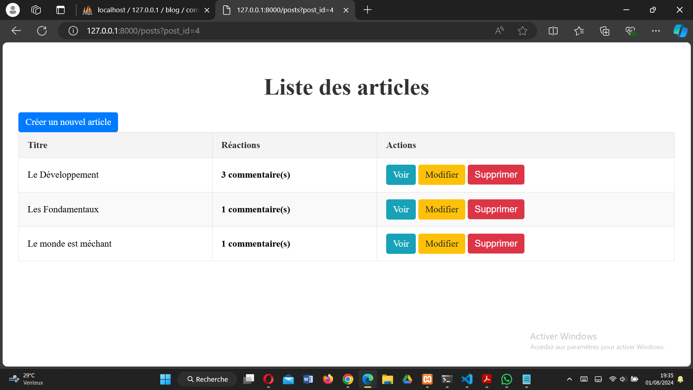
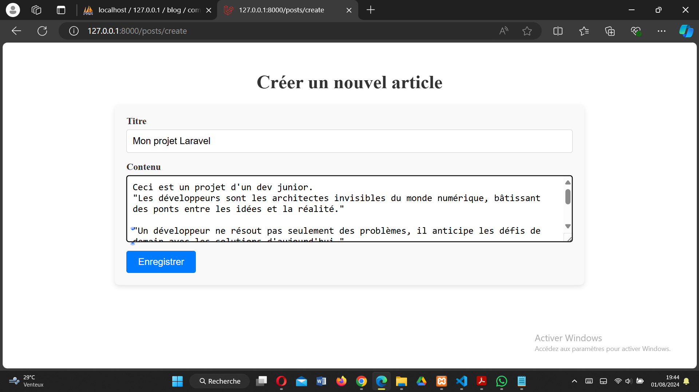
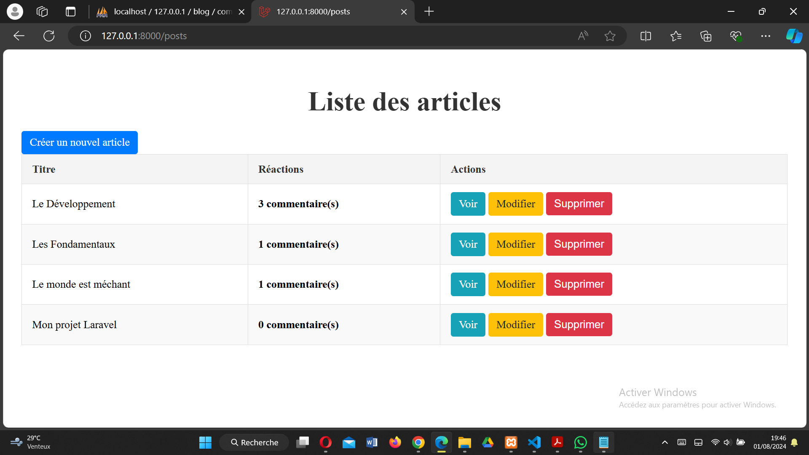
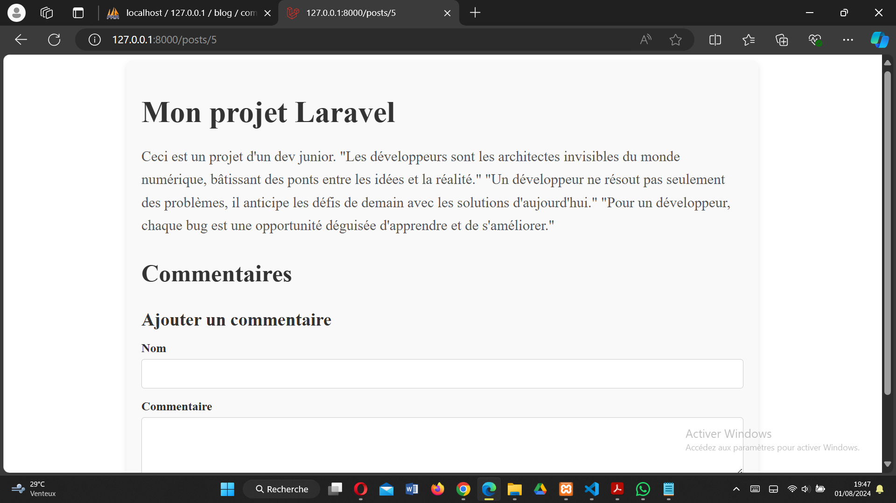
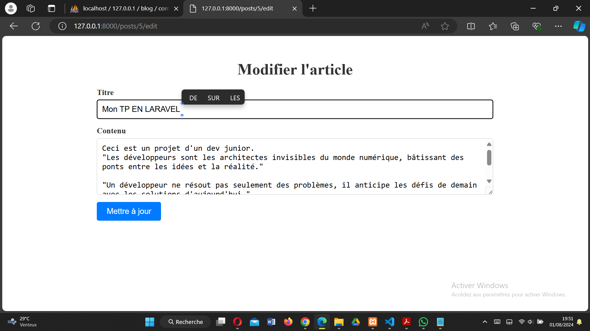
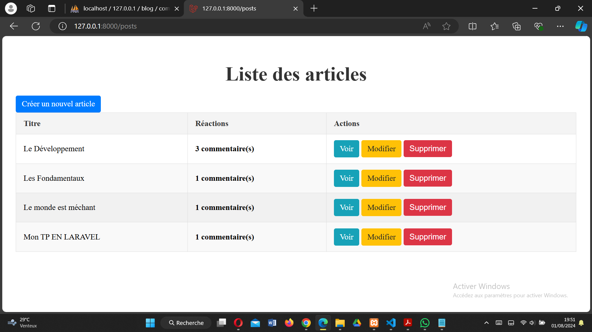
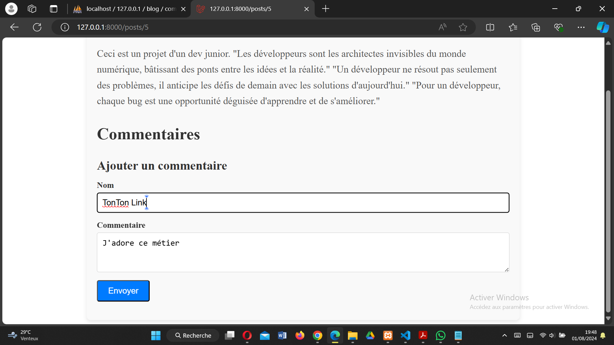
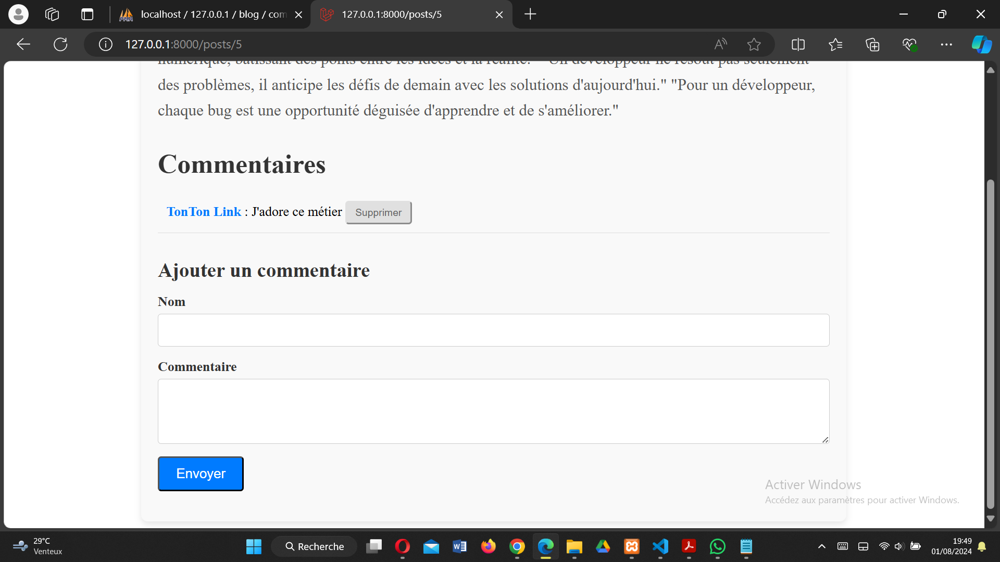
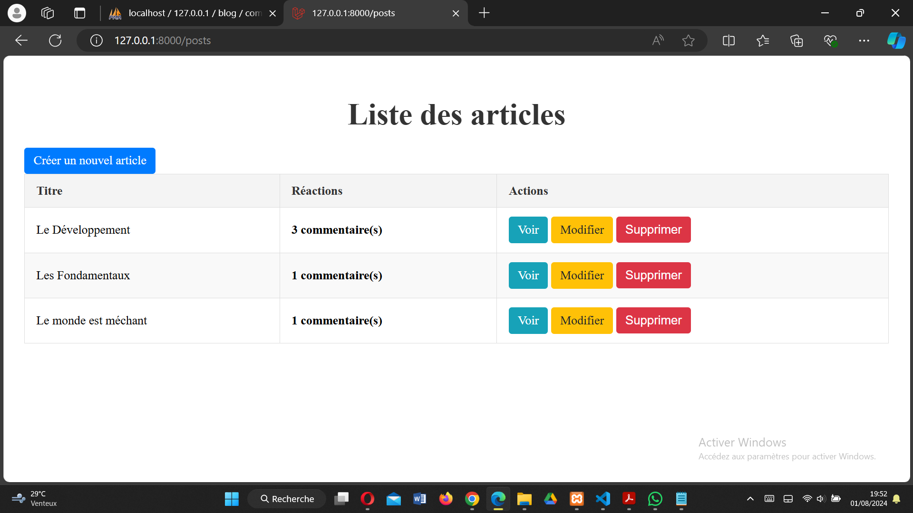

# TP 4 - BLOG SIMPLE

## Fonctionnalités et Interfaces

### 1. Affichage de la liste des articles et le nombre de commentaires

### 2. Créer un article

### 3. Lire un article

### 4. Modifier un article

### 5. Commenter un article

### 6. Supprimer l'article

